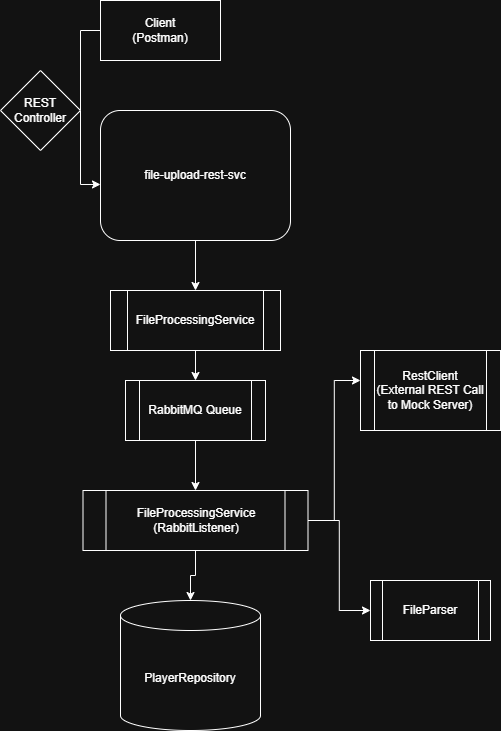

# File Upload & Processing Microservice
This is a simple Spring Boot project microservice designed to accept a CSV file upload, parse and store the data asynchronously using RabbitMQ, and forward the data to a second external service (e.g. a mock server), with retries, and optional time-window restrictions for outbound communication.

## Project Architecture

## Tech Stack
 - Java 17
 - Spring Boot
 - RabbitMq
 - PostgreSQL
 - Docker
 - Postman

## Main Features
| Action Item                                       | Status     |
|---------------------------------------------------|------------|
| 1. Upload a CSV file via REST                     | ✅ Complete |
| 2. Parse CSV & persist to DB                      | ✅ Complete |
| 3. Send data to another service via REST          | ✅ Complete |
| 4. Asynchronous processing using RabbitMQ         | ✅ Complete |
| 5. Retry mechanism with exponential backoff       | ✅ Complete |
| 6. Unit testing                                   | ✅ Complete |
| 7. Time-window control for outbound sending       | ✅ Complete |

## Getting Started
### Prerequisites
- Java 17+
- Docker (for RabbitMQ)
- Local PostgreSQL server 
- Maven installed and configured

Run RabbitMQ via Docker

### Clone repo
Set db configuration properties for your environment

### Start RabbitMQ
`docker run -it --rm --name rabbitmq -p 5672:5672 -p 15672:15672 rabbitmq:4-management`

Login to RabbitMQ UI: http://localhost:15672

Credentials: guest / guest

## How to use
Use Postman to test the file upload.
POST `/api/v1/files/upload`

Body:` multipart/form-data` with one file field

Upload file

## Next Steps:
 - Add Integration test
 - Use flyway for db migration and real control
 - Implement marked TODOs in project
 - Make the app to handle different types of file
 - Add size file check and for duplication
 - Parsing more complex data (maybe some relations also)

## Useful links
https://www.rabbitmq.com/docs/download
https://www.postgresguide.com/utilities/psql/
https://www.postgresql.org/download/

